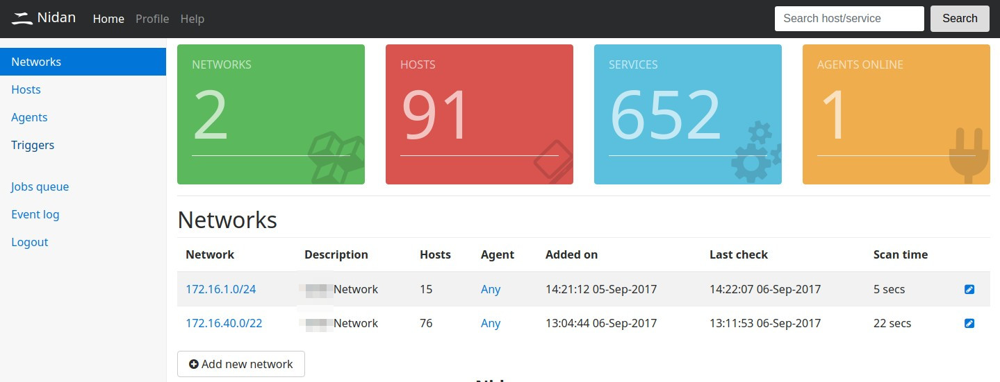
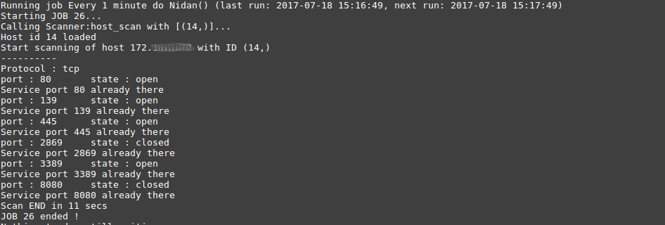

Nidan
=====

Introduction
------------

Nidan is a personal network scanning tool, for use in public and private networks. Nidan continuosly checks for new hosts and new services in 
specified networks, try grabbing TCP/UDP port banners. All data is saved into a MySQL/MariaDB database engine.

How Nidan works
---------------

Nidan consists in a scanning agent, written in Python, and a web controller, written in PHP. Nidan scanning agent use a REST interface to fetch jobs from the controller,
so you can install it into a different server (also behind a NAT !). In most case, both are on the same server.

Nidan agent can be run also as non-privileged users, but scanning tecniques will be not accurate as running as root

## Prerequisites 

For Web frontend and REST server:
* PHP 5.x or 7.x
* Apache 2.4.x
* MySQL 5.x or MariaDB

For Agents:
* NMap 6.x
* Python-nmap module, at least 0.6.1 (pip install python-nmap - https://pypi.python.org/pypi/python-nmap)
* Python schedule (pip install schedule - https://schedule.readthedocs.io/en/stable/)
* Python jsonpickle (pip install jsonpickle)
* Python requests (pip install requests)

## Install Web frontend and REST server

Create a new database ('nidan' ?) and an user with rights to create and use tables. If you need help, please check [How To Create a New User and Grant Permissions in MySQL](https://www.digitalocean.com/community/tutorials/how-to-create-a-new-user-and-grant-permissions-in-mysql)

Now prepare web folder, copying all /web content to web server root folder (usually /var/www/) or wherever you want to store PHP pages.
Enable apache2 mod-rewrite if not ('a2enmod rewrite' as root) and check/change db access configuration in config.inc.php:

    $CFG["db_host"] = "localhost";
    $CFG["db_port"] = "3306";
    $CFG["db_user"] = "nidan";
    $CFG["db_password"] = "nidan";
    $CFG["db_name"] = "nidan";

Then enable "AllowOverride All" in nidan virtual host instance, like:

    <VirtualHost _default_:80>
	ServerAdmin webmaster@localhost

	DocumentRoot /var/www/html

	ErrorLog ${APACHE_LOG_DIR}/nidan-error.log
	CustomLog ${APACHE_LOG_DIR}/nidan-access.log combined

	<Directory /var/www/html>
    	    AllowOverride All
	</Directory>
    </VirtualHost>

and, if you want to use SSL, remember to enable ssl module ('a2enmod ssl' as root) anche change VirtualHost as follow:

    <IfModule mod_ssl.c>
	<VirtualHost _default_:443>
	    ServerAdmin webmaster@localhost

	    <Directory /home/web/default>
		Require all granted
	    </Directory>

	    DocumentRoot /home/web/default

	    ErrorLog ${APACHE_LOG_DIR}/nidan-error.log
	    CustomLog ${APACHE_LOG_DIR}/nidan-access.log combined

	    SSLEngine on

	    SSLCertificateFile /etc/ssl/certs/apache-selfsigned.crt
            SSLCertificateKeyFile /etc/ssl/private/apache-selfsigned.key

            <FilesMatch "\.(cgi|shtml|phtml|php)$">
                SSLOptions +StdEnvVars
            </FilesMatch>
            <Directory /usr/lib/cgi-bin>
                SSLOptions +StdEnvVars
            </Directory>

            <Directory /home/web/default>
		AllowOverride All
	    </Directory>

            BrowserMatch "MSIE [2-6]" \
                   nokeepalive ssl-unclean-shutdown \
                   downgrade-1.0 force-response-1.0
	</VirtualHost>
    </IfModule>

You can use self-signed SSL certs ([How To Create a Self-Signed SSL Certificate for Apache](https://www.digitalocean.com/community/tutorials/how-to-create-a-self-signed-ssl-certificate-for-apache-in-ubuntu-16-04)) 
or use [Let's Encrypt](https://letsencrypt.org/) to get a fully valid free one.

Now add a new cron instance with 'crontab -e', that runs cron.php script every 5 minutes, adding this line:

    # m h  dom mon dow   command
    */5 * * * * php /var/www/html/cron.php &> /dev/null

Open a browser and go to your web server: you should be redirected to /install page, where you can check database connection and install tables and default data.

After, you can login with default username "admin@localhost" and password "admin".

## Install Agents

First, add a new Agent from "Agents" page and write down/copy API key. Now you can use setuptools to install Nidan Agents, so run:

    python setup.py build
    python setup.py install

then copy nidan.cfg file to /etc/nidan/nidan.cfg or ~/.nidan.cfg. Then edit the file and fill apiKey field with API key:

    [Agent]
    api_key=*[this agent API key]*
    server_url=*[URL of the server - i.e. https://localhost/rest]*
    pid_file=/tmp/nid_agent.pid
    log_file=/var/log/nidan.log
    threads_max=5
    sleep_time=10

remember to change serverUrl if needed ! Then save and run nidan.py

Please note that if you use "https", agent try to connect to SSL port (TCP 443) and fail if something don't work.

## Troubleshoting

If an job failed with "Unexpected error: (<type 'exceptions.AttributeError'>, AttributeError("'module' object has no attribute 'PortScanner'",)" maybe you have to install python-nmap module. Run "sudo pip install python-nmap" to fix.

If agent failed to connect with "requests.exceptions.ConnectionError: HTTPSConnectionPool(host='localhost', port=443): Max retries exceeded with url: /rest/agent/start (Caused by NewConnectionError('<urllib3.connection.VerifiedHTTPSConnection object at 0x7f43258d1150>: Failed to establish a new connection: [Errno 111] Connection refused',))" you have to checy your apache2 ssl configuration.

If agent raise an exception with this error: "Unexpected error: (<class 'nmap.nmap.PortScannerError'>, PortScannerError exception nmap program was not found in path." you need to install nmap with 'apt install nmap'

## Need support ?

Join our public ML [nidan-users-ml](https://groups.google.com/forum/#!forum/nidan-users-ml "Nidan users ML") to help and receive support from users and developers

## Want to support Nidan developement ? Get a shirt !

Developing Nidan costs time and money. Please support us buying a [Nidan t-shirts](https://shop.spreadshirt.it/Nidan/) or [donate via PayPal](https://PayPal.Me/MichelePinassi)

## Author

Nidan was written by Michele <o-zone@zerozone.it> Pinassi

## License

Nidan is under MIT license. No any warranty. Please use responsibly.
